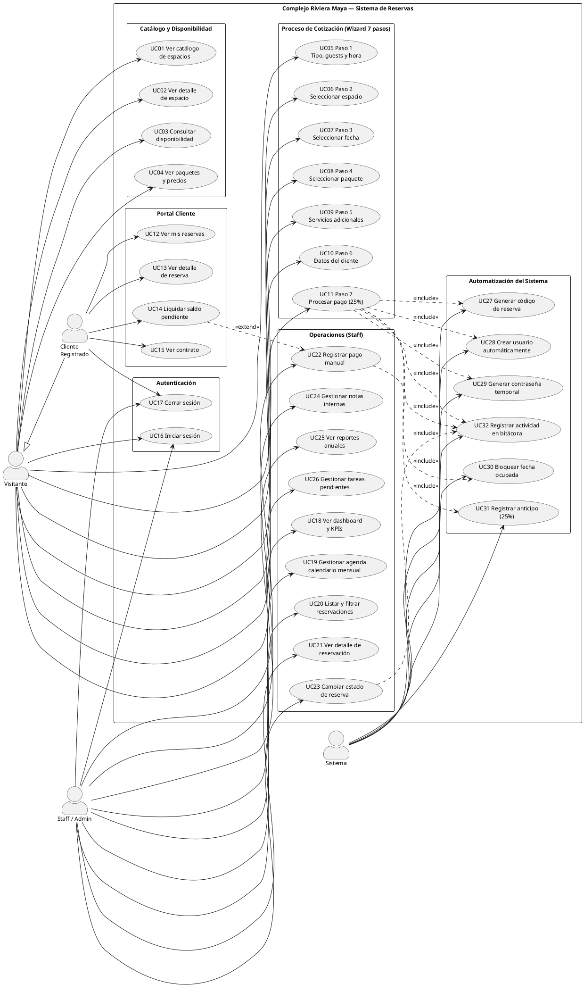
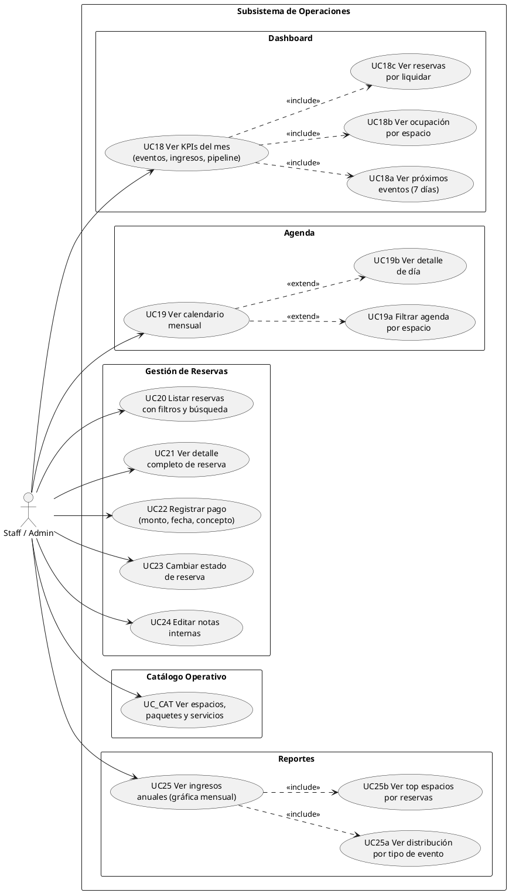
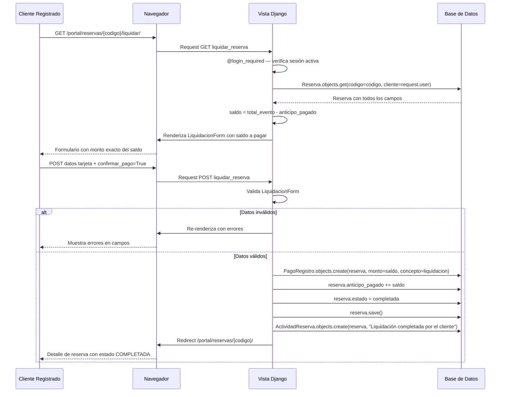
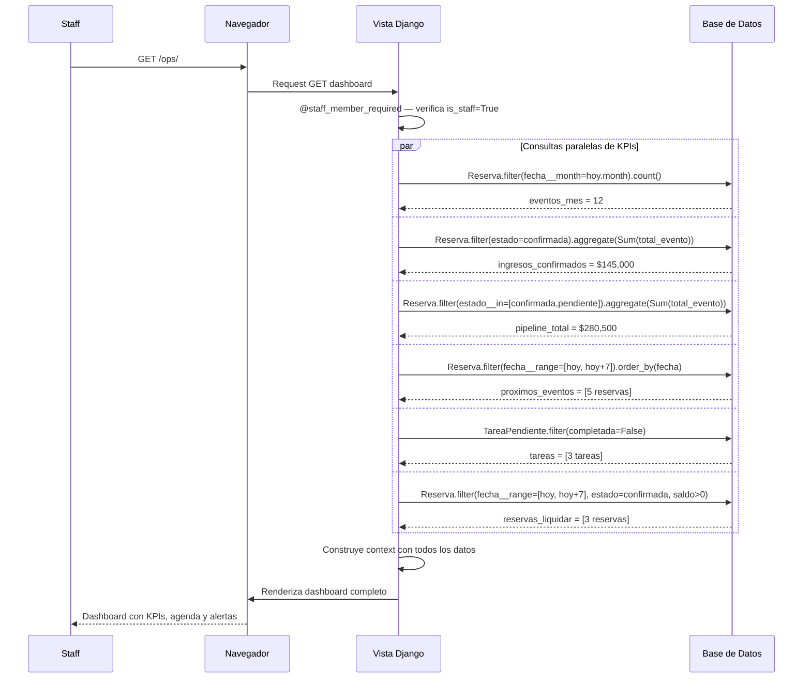
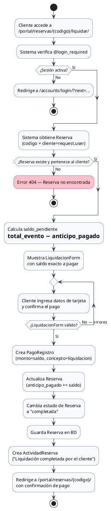
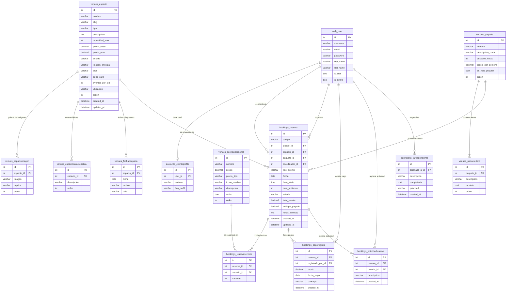

# Sistema de Gestión — Complejo Riviera Maya
### Salón de Eventos · Documentación Técnica v1.0 · Junio 2025

> **Cómo renderizar los diagramas:**
> - **PlantUML** (bloques `plantuml`): [plantuml.com](https://www.plantuml.com/plantuml) o extensión **PlantUML** de VS Code.
> - **Mermaid** (bloques `mermaid`): extensión **Mermaid Preview** de VS Code o GitHub (soporte nativo).

---

# 1. Diagramas de Casos de Uso

## 1.1 Diagrama General del Sistema



---

## 1.2 Subsistema de Cotización (Detalle)

```plantuml
@startuml UCS_Cotizacion
left to right direction
skinparam packageStyle rectangle

actor "Visitante" as V
actor "Sistema" as SYS

rectangle "Subsistema de Cotización" {
  usecase "Iniciar cotización\n(/cotizar/)" as UC_INIT
  usecase "Paso 1: Tipo de evento,\nguests y hora inicio" as UC_P1
  usecase "Paso 2: Seleccionar\nespacio disponible" as UC_P2
  usecase "Paso 3: Seleccionar\nfecha del evento" as UC_P3
  usecase "Verificar disponibilidad\nde fecha (FechaOcupada)" as UC_DISP
  usecase "Paso 4: Seleccionar\npaquete" as UC_P4
  usecase "Paso 5: Agregar servicios\nadicionales (opcional)" as UC_P5
  usecase "Paso 6: Ingresar datos\npersonales" as UC_P6
  usecase "Paso 7: Procesar pago\n(anticipo 25%)" as UC_P7
  usecase "Calcular total y\nanticipo" as UC_CALC
  usecase "Crear reserva con todos\nsus registros asociados" as UC_CREATE
  usecase "Mostrar confirmación\ny contraseña temporal" as UC_CONFIRM
}

V --> UC_INIT
UC_INIT ..> UC_P1 : <<include>>
UC_P1 ..> UC_P2 : <<include>>
UC_P2 ..> UC_P3 : <<include>>
UC_P3 ..> UC_DISP : <<include>>
UC_DISP ..> UC_P4 : <<extend>>\n[fecha disponible]
UC_P4 ..> UC_P5 : <<include>>
UC_P5 ..> UC_P6 : <<include>>
UC_P6 ..> UC_P7 : <<include>>
UC_P7 ..> UC_CALC : <<include>>
UC_P7 ..> UC_CREATE : <<include>>
UC_CREATE ..> UC_CONFIRM : <<include>>

SYS --> UC_DISP
SYS --> UC_CALC
SYS --> UC_CREATE

@enduml
```



---

## 1.3 Subsistema de Operaciones (Staff)



---

# 2. Especificaciones de Casos de Uso

## UC-01 — Completar Proceso de Cotización y Reserva

| Campo | Descripción |
|-------|-------------|
| **ID** | UC-01 |
| **Nombre** | Completar Proceso de Cotización y Reserva |
| **Actor principal** | Visitante (puede ser nuevo o cliente existente) |
| **Actores secundarios** | Sistema |
| **Precondiciones** | Ninguna — acceso público, sin requerir sesión |
| **Postcondiciones** | Reserva creada en BD, fecha bloqueada, cliente autenticado, anticipo registrado |
| **Prioridad** | Alta |
| **Frecuencia de uso** | Varias veces por semana |

### Flujo Principal

| # | Actor | Acción |
|---|-------|--------|
| 1 | Visitante | Accede a `/cotizar/` |
| 2 | Sistema | Muestra formulario Paso 1 con opciones de tipo de evento, campo de invitados y selector de hora |
| 3 | Visitante | Selecciona tipo de evento (boda/XV/bautizo/aniversario/empresarial/cumpleaños), ingresa número de invitados (1-600) y hora de inicio (14:00-20:00) |
| 4 | Sistema | Valida campos; guarda en `request.session['cotizador']`; redirige a Paso 2 |
| 5 | Visitante | Selecciona un espacio de las tarjetas mostradas |
| 6 | Sistema | Guarda `espacio_id` en sesión; actualiza resumen de costo; redirige a Paso 3 |
| 7 | Visitante | Selecciona una fecha en el calendario |
| 8 | Sistema | Consulta `FechaOcupada` para ese espacio; si está libre, guarda `fecha` y redirige a Paso 4 |
| 9 | Visitante | Selecciona paquete (básico / premium / lujo) |
| 10 | Sistema | Guarda `paquete_id` en sesión; actualiza total estimado en sidebar; redirige a Paso 5 |
| 11 | Visitante | Selecciona servicios adicionales (opcional, múltiple) |
| 12 | Sistema | Guarda `servicios[]` en sesión; recalcula total; redirige a Paso 6 |
| 13 | Visitante | Ingresa nombre, apellidos, email y teléfono |
| 14 | Sistema | Guarda datos de contacto en sesión; redirige a Paso 7 |
| 15 | Visitante | Ingresa nombre del titular, número de tarjeta (16 dígitos), vencimiento (MM/AA), CVV (3 dígitos) y acepta términos |
| 16 | Sistema | Valida formato de todos los campos del formulario de pago |
| 17 | Sistema | Ejecuta `_calcular_total()`: `total = precio_base_espacio + (precio_por_persona × guests) + extras`; `anticipo = total × 0.25` |
| 18 | Sistema | `User.objects.get_or_create(username=email)`: si es nuevo, genera contraseña de 10 caracteres con `_generar_contrasena()` y crea `ClienteProfile` |
| 19 | Sistema | Crea `Reserva` con código único `RM-{YYYY}-{4 dígitos aleatorios}` y todos los campos del wizard |
| 20 | Sistema | Crea registros `ReservaServicio` por cada servicio adicional seleccionado |
| 21 | Sistema | Crea `FechaOcupada(espacio, fecha, motivo='reserva')` — bloquea la fecha |
| 22 | Sistema | Crea `PagoRegistro(monto=anticipo, concepto='anticipo')` |
| 23 | Sistema | Crea `ActividadReserva(descripcion='Reserva creada vía cotizador web')` |
| 24 | Sistema | Ejecuta `auth.login(request, user)`; limpia sesión del cotizador |
| 25 | Sistema | Redirige a `/cotizar/confirmacion/{codigo}/` con resumen y contraseña temporal si es usuario nuevo |

### Flujos Alternativos

**FA-1: Fecha no disponible (Paso 8)**
1. Sistema detecta que `FechaOcupada` contiene esa combinación espacio+fecha
2. Muestra error: *"Lo sentimos, esta fecha ya no está disponible para el espacio seleccionado"*
3. Visitante elige otra fecha (regresa al Paso 7)

**FA-2: Usuario ya registrado (Paso 18)**
1. `get_or_create` retorna `created=False`
2. Sistema usa el `User` existente sin alterar su contraseña
3. Continúa desde Paso 19

**FA-3: Datos de tarjeta inválidos (Paso 16)**
1. Validación falla: tarjeta ≠ 16 dígitos, vencimiento expirado o formato incorrecto, CVV ≠ 3 dígitos, o sin aceptar términos
2. Re-renderiza el formulario Paso 7 con los errores indicados
3. Visitante corrige y reenvía

**FA-4: Sesión expirada o incompleta**
1. Sistema detecta que `request.session['cotizador']` está vacío o faltan pasos previos
2. Redirige al Paso 1 con mensaje informativo

### Reglas de Negocio
- Anticipo obligatorio: exactamente el **25%** del total del evento
- Invitados: mínimo 1, máximo 600
- Horario de inicio: de **14:00 a 20:00 hrs** (7 opciones cada hora)
- Código de reserva: formato `RM-{YYYY}-{4 dígitos}`, único, irrepetible
- Una fecha bloquea el espacio completo (un evento por día por espacio)
- La contraseña temporal se muestra **una sola vez** en la página de confirmación

---

## UC-02 — Liquidar Saldo Pendiente de Reserva

| Campo | Descripción |
|-------|-------------|
| **ID** | UC-02 |
| **Nombre** | Liquidar Saldo Pendiente de Reserva |
| **Actor principal** | Cliente Registrado |
| **Precondiciones** | Cliente autenticado; reserva con `estado = confirmada` o `pendiente_liquidacion` |
| **Postcondiciones** | `PagoRegistro` creado con concepto `liquidacion`; `anticipo_pagado` actualizado; estado cambia a `completada` |
| **Prioridad** | Alta |

### Flujo Principal

| # | Actor | Acción |
|---|-------|--------|
| 1 | Cliente | Accede a "Mis Reservas" en `/portal/reservas/` |
| 2 | Sistema | Muestra listado de reservas del cliente con el saldo pendiente resaltado |
| 3 | Cliente | Hace clic en **"Liquidar saldo"** en la reserva deseada |
| 4 | Sistema | Calcula `saldo = total_evento − anticipo_pagado`; muestra `LiquidacionForm` con el monto a pagar |
| 5 | Cliente | Ingresa datos de tarjeta y marca "Confirmar pago" |
| 6 | Sistema | Valida `LiquidacionForm` (mismas reglas que Paso 7) |
| 7 | Sistema | Crea `PagoRegistro(monto=saldo, concepto='liquidacion')` |
| 8 | Sistema | Actualiza `reserva.anticipo_pagado += saldo` |
| 9 | Sistema | Cambia `reserva.estado = 'completada'` |
| 10 | Sistema | Crea `ActividadReserva("Liquidación completada por el cliente")` |
| 11 | Sistema | Redirige a `/portal/reservas/{codigo}/` con banner de confirmación |

---

## UC-03 — Registrar Pago Manual (Staff)

| Campo | Descripción |
|-------|-------------|
| **ID** | UC-03 |
| **Nombre** | Registrar Pago Manual en Reservación |
| **Actor principal** | Staff / Admin |
| **Precondiciones** | Usuario staff autenticado (`is_staff=True`); reserva existente en el sistema |
| **Postcondiciones** | `PagoRegistro` creado; `anticipo_pagado` actualizado; actividad registrada |
| **Prioridad** | Media |

### Flujo Principal

| # | Actor | Acción |
|---|-------|--------|
| 1 | Staff | Accede a `/ops/reservas/{codigo}/` |
| 2 | Sistema | Verifica `@staff_member_required`; carga reserva con servicios, pagos y bitácora |
| 3 | Staff | Localiza el panel "Registrar pago" en la vista de detalle |
| 4 | Sistema | Muestra formulario: monto, fecha_pago, concepto (anticipo/liquidacion/extra) |
| 5 | Staff | Completa el formulario y envía |
| 6 | Sistema | Crea `PagoRegistro(monto, fecha_pago, concepto, registrado_por=staff_user)` |
| 7 | Sistema | Actualiza `reserva.anticipo_pagado += monto; reserva.save()` |
| 8 | Sistema | Crea `ActividadReserva(f"Pago de ${monto} registrado por {staff}", usuario=staff)` |
| 9 | Sistema | Redirige a la misma vista de detalle con el nuevo pago visible en historial |

---

## UC-04 — Consultar Dashboard de Operaciones

| Campo | Descripción |
|-------|-------------|
| **ID** | UC-04 |
| **Nombre** | Consultar Dashboard y KPIs del Sistema |
| **Actor principal** | Staff / Admin |
| **Precondiciones** | Usuario con `is_staff=True` autenticado |
| **Postcondiciones** | Ninguna — operación de solo lectura |
| **Prioridad** | Media |

### Flujo Principal

| # | Actor | Acción |
|---|-------|--------|
| 1 | Staff | Accede a `/ops/` |
| 2 | Sistema | Calcula `eventos_mes`: reservas del mes con estado `confirmada` o `completada` |
| 3 | Sistema | Suma `ingresos_confirmados` de reservas del mes |
| 4 | Sistema | Suma `pipeline_total` de todas las reservas activas |
| 5 | Sistema | Obtiene `proximos_eventos`: reservas con fecha en los próximos 7 días |
| 6 | Sistema | Calcula `ocupacion_por_espacio`: % de días con evento en el mes |
| 7 | Sistema | Obtiene `reservas_liquidar`: reservas con saldo pendiente y evento en 7 días |
| 8 | Sistema | Lista `tareas_pendientes` sin completar |
| 9 | Sistema | Renderiza dashboard completo con todos los datos |

---

## UC-05 — Gestionar Agenda Mensual (Staff)

| Campo | Descripción |
|-------|-------------|
| **ID** | UC-05 |
| **Nombre** | Gestionar Agenda y Calendario Mensual |
| **Actor principal** | Staff / Admin |
| **Precondiciones** | Usuario staff autenticado |
| **Postcondiciones** | Ninguna — solo visualización |
| **Prioridad** | Media |

### Flujo Principal

| # | Actor | Acción |
|---|-------|--------|
| 1 | Staff | Accede a `/ops/agenda/` |
| 2 | Sistema | Obtiene el mes/año actual (o del parámetro GET); construye estructura de calendario |
| 3 | Sistema | Carga todas las reservas del mes y las asocia a sus días |
| 4 | Sistema | Calcula métricas del mes: total eventos, invitados, ingreso esperado, días ocupados |
| 5 | Sistema | Renderiza calendario con días resaltados donde hay eventos |
| 6 | Staff | Aplica filtro por espacio (GET `?espacio=id`) |
| 7 | Sistema | Re-renderiza mostrando solo eventos del espacio seleccionado |
| 8 | Staff | Hace clic en un día con evento |
| 9 | Sistema | Muestra panel lateral con detalle del evento ese día |

---

# 3. Mock-ups del Sistema

> Los mock-ups utilizan notación ASCII para representar la estructura visual de cada pantalla principal.

## 3.1 Página Principal (Home)

```
┌──────────────────────────────────────────────────────────────────────┐
│  ⚡ RIVIERA MAYA                        [Iniciar sesión]  [Cotizar] │
│  [Inicio] [Espacios] [Paquetes] [Disponibilidad]                    │
├──────────────────────────────────────────────────────────────────────┤
│                                                                      │
│  ╔════════════════════════════════════════════════════╗              │
│  ║                                                    ║              │
│  ║       TU EVENTO PERFECTO TE ESPERA                ║              │
│  ║   Espacios únicos para momentos inolvidables       ║              │
│  ║                                                    ║              │
│  ║            [ COTIZAR MI EVENTO ]                   ║              │
│  ╚════════════════════════════════════════════════════╝              │
│                    — IMAGEN HERO —                                   │
│                                                                      │
├──────────────────────────────────────────────────────────────────────┤
│  NUESTROS ESPACIOS DESTACADOS                                        │
│                                                                      │
│  ┌────────────┐  ┌────────────┐  ┌────────────┐  ┌────────────┐   │
│  │ [IMAGEN]   │  │ [IMAGEN]   │  │ [IMAGEN]   │  │ [IMAGEN]   │   │
│  │            │  │            │  │            │  │            │   │
│  │ Jardín     │  │ Salón      │  │ Terraza    │  │ Palapa     │   │
│  │ Tropical   │  │ Imperial   │  │ del Mar    │  │ Colonial   │   │
│  │ Exterior   │  │ Interior   │  │ Vista mar  │  │ Versátil   │   │
│  │ 300 pers.  │  │ 500 pers.  │  │ 200 pers.  │  │ 150 pers.  │   │
│  │ $15,000+   │  │ $22,000+   │  │ $18,000+   │  │ $12,000+   │   │
│  │[Ver espacio]│  │[Ver espacio]│  │[Ver espacio]│  │[Ver espacio]│  │
│  └────────────┘  └────────────┘  └────────────┘  └────────────┘   │
│                                                                      │
├──────────────────────────────────────────────────────────────────────┤
│  NUESTROS PAQUETES                                                   │
│                                                                      │
│  ┌──────────────┐  ┌──────────────┐  ┌──────────────┐             │
│  │   BÁSICO     │  │ ★ PREMIUM ★  │  │    LUJO      │             │
│  │  $X/persona  │  │  $X/persona  │  │  $X/persona  │             │
│  │ ──────────── │  │ ──────────── │  │ ──────────── │             │
│  │ ✓ Mesas      │  │ ✓ Todo bás.  │  │ ✓ Todo prem. │             │
│  │ ✓ Mantelería │  │ ✓ Decoración │  │ ✓ Chef privado│             │
│  │ ✓ Iluminación│  │ ✓ DJ/música  │  │ ✓ Open bar   │             │
│  │ ✓ Coordinador│  │ ✓ Flores     │  │ ✓ Fuegos art.│             │
│  │              │  │              │  │              │             │
│  │  [ Cotizar ] │  │  [ Cotizar ] │  │  [ Cotizar ] │             │
│  └──────────────┘  └──────────────┘  └──────────────┘             │
│                                                                      │
└──────────────────────────────────────────────────────────────────────┘
  © 2025 Complejo Riviera Maya · Todos los derechos reservados
```

---

## 3.2 Catálogo de Espacios

```
┌──────────────────────────────────────────────────────────────────────┐
│  ⚡ RIVIERA MAYA                        [Iniciar sesión]  [Cotizar] │
├──────────────────────────────────────────────────────────────────────┤
│  CATÁLOGO DE ESPACIOS                                                │
│  ────────────────────────────────────────────────────────────────── │
│  Filtrar por tipo:                                                   │
│  [Todos] [Interior] [Exterior] [Vista al mar]                        │
│                                                                      │
│  Capacidad: [Hasta 200] [200 - 400] [Más de 400]                    │
│                                                                      │
│  ┌────────────────────────┐  ┌────────────────────────┐            │
│  │   [IMAGEN 400×280]     │  │   [IMAGEN 400×280]     │            │
│  │                        │  │                        │            │
│  │ Jardín Tropical        │  │ Salón Imperial         │            │
│  │ ─────────────────────  │  │ ─────────────────────  │            │
│  │ 🌿 Exterior Tropical   │  │ ❄️ Interior Climatizado │            │
│  │ 👥 Hasta 300 personas  │  │ 👥 Hasta 500 personas  │            │
│  │ 📍 Complejo Riviera M. │  │ 📍 Complejo Riviera M. │            │
│  │ 💰 Desde $15,000       │  │ 💰 Desde $22,000       │            │
│  │   ✓ Jardín · Bar       │  │   ✓ A/C · Sonido       │            │
│  │         [Ver detalles] │  │         [Ver detalles] │            │
│  └────────────────────────┘  └────────────────────────┘            │
│                                                                      │
│  ┌────────────────────────┐  ┌────────────────────────┐            │
│  │   [IMAGEN 400×280]     │  │   [IMAGEN 400×280]     │            │
│  │                        │  │                        │            │
│  │ Terraza del Mar        │  │ Palapa Colonial        │            │
│  │ ─────────────────────  │  │ ─────────────────────  │            │
│  │ 🌊 Exterior + Vista Mar│  │ 🏛️ Interior Versátil  │            │
│  │ 👥 Hasta 200 personas  │  │ 👥 Hasta 150 personas  │            │
│  │ 📍 Complejo Riviera M. │  │ 📍 Complejo Riviera M. │            │
│  │ 💰 Desde $18,000       │  │ 💰 Desde $12,000       │            │
│  │   ✓ Vista al mar       │  │   ✓ Terraza privada    │            │
│  │         [Ver detalles] │  │         [Ver detalles] │            │
│  └────────────────────────┘  └────────────────────────┘            │
└──────────────────────────────────────────────────────────────────────┘
```

---

## 3.3 Cotizador — Wizard 7 Pasos

### Paso 1 — Tipo de Evento

```
┌──────────────────────────────────────────────────────────────────────┐
│  COTIZAR MI EVENTO                                                   │
│  Paso 1 de 7 — Detalles del evento                                  │
│                                                                      │
│  ● ──────── ○ ──────── ○ ──────── ○ ──────── ○ ──────── ○ ──────── ○│
│ [1]Tipo  [2]Espacio [3]Fecha  [4]Paquete [5]Extras [6]Datos [7]Pago │
├────────────────────────────────┬─────────────────────────────────────┤
│                                │  📋 RESUMEN COTIZACIÓN              │
│  ¿Cuál es tu evento?           │  ─────────────────────────────      │
│                                │  Tipo de evento:        —           │
│  ○ 💍 Boda                    │  Nro. invitados:        —           │
│  ○ 🌹 XV Años                 │  Hora de inicio:        —           │
│  ○ 🕊️ Bautizo               │  Espacio:               —           │
│  ○ 💑 Aniversario             │  Paquete:               —           │
│  ○ 💼 Empresarial             │  Extras:                —           │
│  ○ 🎂 Cumpleaños              │  ─────────────────────────────      │
│                                │  Subtotal:         $ ——,———         │
│  ¿Cuántos invitados?           │  Anticipo (25%):   $ ——,———         │
│  ┌──────────────────────┐      │                                     │
│  │  150                 │      │                                     │
│  └──────────────────────┘      │                                     │
│  (Mínimo 1, máximo 600)        │                                     │
│                                │                                     │
│  Hora de inicio:               │                                     │
│  ┌──────────────────────┐      │                                     │
│  │  17:00 hrs        [▼]│      │                                     │
│  └──────────────────────┘      │                                     │
│                                │                                     │
│             [ Continuar → ]    │                                     │
└────────────────────────────────┴─────────────────────────────────────┘
```

### Paso 3 — Selección de Fecha

```
┌──────────────────────────────────────────────────────────────────────┐
│  COTIZAR MI EVENTO                                                   │
│  Paso 3 de 7 — Selección de fecha                                   │
│                                                                      │
│  ✓ ──────── ✓ ──────── ● ──────── ○ ──────── ○ ──────── ○ ──────── ○│
├────────────────────────────────┬─────────────────────────────────────┤
│                                │  📋 RESUMEN COTIZACIÓN              │
│  Elige la fecha de tu evento   │  ─────────────────────────────      │
│                                │  Tipo:         Boda                 │
│        JUNIO 2025              │  Invitados:    150                  │
│  ┌──────────────────────┐      │  Hora:         17:00 hrs            │
│  │ Lu  Ma  Mi  Ju  Vi  Sá  Do │  │  Espacio:      Jardín Tropical     │
│  │                  1   2  │  │  Fecha:             —               │
│  │  3   4   5   6   7   8   9 │  │  Paquete:           —             │
│  │ 10  11  12  13  14  15  16 │  │  ─────────────────────────────    │
│  │ 17  18  19  20  21 [22] 23 │  │  Subtotal:     $ 18,000           │
│  │ 24  25  26  27  28  29  30 │  │  Anticipo(25%):$ ——,———           │
│  └──────────────────────┘      │                                     │
│                                │                                     │
│  🔴 Fecha ocupada              │                                     │
│  🟢 Disponible                 │                                     │
│  🔵 Seleccionada               │                                     │
│                                │                                     │
│  Fecha elegida:                │                                     │
│  ┌──────────────────────┐      │                                     │
│  │  22/06/2025          │      │                                     │
│  └──────────────────────┘      │                                     │
│                                │                                     │
│  [← Volver]  [ Continuar → ]   │                                     │
└────────────────────────────────┴─────────────────────────────────────┘
```

### Paso 7 — Pago (Anticipo 25%)

```
┌──────────────────────────────────────────────────────────────────────┐
│  COTIZAR MI EVENTO                                                   │
│  Paso 7 de 7 — Confirmar y pagar anticipo                           │
│                                                                      │
│  ✓ ──────── ✓ ──────── ✓ ──────── ✓ ──────── ✓ ──────── ✓ ──────── ●│
├────────────────────────────────┬─────────────────────────────────────┤
│                                │  📋 RESUMEN FINAL                   │
│  Datos de pago                 │  ─────────────────────────────      │
│                                │  Renta Jardín Tropical: $15,000     │
│  Nombre del titular:           │  Paquete Premium:                   │
│  ┌──────────────────────┐      │    150 × $350/pers.:  $52,500       │
│  │  Juan García López   │      │  Foto y video:         $ 3,500      │
│  └──────────────────────┘      │  DJ Profesional:        $ 5,000     │
│                                │  ─────────────────────────────      │
│  Número de tarjeta:            │  TOTAL EVENTO:         $76,000      │
│  ┌──────────────────────┐      │                                     │
│  │  ···· ···· ···· ····  │      │  Anticipo a pagar                  │
│  └──────────────────────┘      │  (25%):                $19,000      │
│                                │                                     │
│  Vencimiento:      CVV:        │  Saldo restante:       $57,000      │
│  ┌──────────┐  ┌───────┐       │  (se liquida antes del evento)      │
│  │  MM/AA   │  │  ···  │       │                                     │
│  └──────────┘  └───────┘       │                                     │
│                                │                                     │
│  ☐ Acepto los términos y       │                                     │
│    condiciones del servicio    │                                     │
│                                │                                     │
│  [← Volver]                    │                                     │
│  [ ✓ CONFIRMAR Y PAGAR $19,000]│                                     │
└────────────────────────────────┴─────────────────────────────────────┘
```

### Confirmación de Reserva

```
┌──────────────────────────────────────────────────────────────────────┐
│                    ✅ ¡RESERVA CONFIRMADA!                           │
│                                                                      │
│           Tu código de reserva es:  RM-2025-0047                    │
│                                                                      │
│  ┌──────────────────────────────────────────────────────────────┐   │
│  │  RESUMEN DE TU RESERVA                                       │   │
│  │  ─────────────────────────────────────────────────────────   │   │
│  │  Evento:        Boda · 150 invitados                         │   │
│  │  Espacio:       Jardín Tropical                              │   │
│  │  Fecha:         Sábado 22 de Junio 2025 · 17:00 hrs         │   │
│  │  Paquete:       Premium                                      │   │
│  │  Extras:        Foto y video, DJ Profesional                 │   │
│  │                                                              │   │
│  │  Total del evento:    $76,000                                │   │
│  │  Anticipo pagado:     $19,000 ✓                              │   │
│  │  Saldo pendiente:     $57,000                                │   │
│  └──────────────────────────────────────────────────────────────┘   │
│                                                                      │
│  ╔══════════════════════════════════════════════════════════════╗   │
│  ║  🔑 ACCESO A TU PORTAL DE CLIENTE                           ║   │
│  ║  Tu cuenta fue creada automáticamente:                      ║   │
│  ║  Usuario:     juan@email.com                                ║   │
│  ║  Contraseña:  Xk9mP2qA7n  (cámbiala al iniciar sesión)     ║   │
│  ╚══════════════════════════════════════════════════════════════╝   │
│                                                                      │
│       [ Ver mis reservas ]         [ Descargar contrato ]           │
└──────────────────────────────────────────────────────────────────────┘
```

---

## 3.4 Portal Cliente — Mis Reservas

```
┌──────────────────────────────────────────────────────────────────────┐
│  ⚡ RIVIERA MAYA · Mi Portal         [Hola, Juan García ▼]  [Salir] │
├──────────────────────────────────────────────────────────────────────┤
│  MIS RESERVAS                                                        │
│                                                                      │
│  ┌──────────────┐  ┌────────────────────────┐  ┌────────────────┐  │
│  │ Reservas     │  │ Total invertido        │  │ Próximo evento │  │
│  │ activas:  2  │  │   $95,000              │  │ 22 Jun 2025    │  │
│  │              │  │                        │  │ Jardín Trop.   │  │
│  └──────────────┘  └────────────────────────┘  └────────────────┘  │
│                                                                      │
│  [Todas ▼]  [Confirmadas]  [Pendiente pago]  [Completadas]          │
│                                                                      │
│  ┌──────────────────────────────────────────────────────────────┐   │
│  │  RM-2025-0047                              ● CONFIRMADA      │   │
│  │  ──────────────────────────────────────────────────────────  │   │
│  │  Jardín Tropical · Boda · Sáb 22 Jun 2025 · 17:00 hrs       │   │
│  │  150 invitados · Paquete Premium                             │   │
│  │                                                              │   │
│  │  Total evento:    $76,000                                    │   │
│  │  Anticipo pag.:   $19,000  ████░░░░░░░░░░░░░░░  25%         │   │
│  │  Saldo pend.:     $57,000                                    │   │
│  │                                                              │   │
│  │                   [ Ver contrato ]  [ Liquidar saldo ]       │   │
│  └──────────────────────────────────────────────────────────────┘   │
│                                                                      │
│  ┌──────────────────────────────────────────────────────────────┐   │
│  │  RM-2025-0021                            ✓ COMPLETADA        │   │
│  │  ──────────────────────────────────────────────────────────  │   │
│  │  Salón Imperial · Aniversario · Sáb 10 Mar 2025 · 18:00 hrs │   │
│  │  80 invitados · Paquete Lujo                                 │   │
│  │                                                              │   │
│  │  Total evento:    $48,500                                    │   │
│  │  Pagado:          $48,500  ████████████████████  100%        │   │
│  │                                                              │   │
│  │                                     [ Ver contrato ]         │   │
│  └──────────────────────────────────────────────────────────────┘   │
└──────────────────────────────────────────────────────────────────────┘
```

---

## 3.5 Panel de Operaciones — Dashboard

```
┌──────────────────────────────────────────────────────────────────────┐
│  ≡ PANEL DE OPERACIONES                      [Admin ▼]  [Salir]    │
│  [Dashboard] [Agenda] [Reservas] [Catálogo] [Reportes]              │
├──────────────────────────────────────────────────────────────────────┤
│  Buenos días, Administrador · Junio 2025                            │
│                                                                      │
│  ┌──────────────┐  ┌──────────────┐  ┌──────────────┐  ┌────────┐ │
│  │ Eventos/Mes  │  │ Ingresos     │  │ Pipeline     │  │  Ocup. │ │
│  │     12       │  │  $145,000    │  │  $280,500    │  │  72%   │ │
│  │ confirmados  │  │  del mes     │  │  en proceso  │  │  tasa  │ │
│  └──────────────┘  └──────────────┘  └──────────────┘  └────────┘ │
│                                                                      │
│  ┌──────────────────────────────────┐  ┌────────────────────────┐  │
│  │  PRÓXIMOS EVENTOS (7 días)       │  │  TAREAS PENDIENTES     │  │
│  │                                  │  │                        │  │
│  │  12 Jun · Salón Imperial         │  │  🔴 Confirmar reserva  │  │
│  │    Boda · 250 inv. · RM-0042     │  │     RM-2025-0045       │  │
│  │                                  │  │  🟡 Enviar cotización  │  │
│  │  13 Jun · Jardín Tropical        │  │     a cliente Pérez    │  │
│  │    XV Años · 180 inv. · RM-0039  │  │  🟢 Actualizar fotos   │  │
│  │                                  │  │     del catálogo       │  │
│  │  22 Jun · Jardín Tropical        │  │                        │  │
│  │    Boda · 150 inv. · RM-0047     │  │  [ + Nueva tarea ]     │  │
│  └──────────────────────────────────┘  └────────────────────────┘  │
│                                                                      │
│  ┌──────────────────────────────────┐  ┌────────────────────────┐  │
│  │  OCUPACIÓN POR ESPACIO           │  │  POR LIQUIDAR (7 días) │  │
│  │                                  │  │                        │  │
│  │  Salón Imperial                  │  │  RM-2025-0047          │  │
│  │  ██████████████████░░  85%      │  │    $57,000 pendiente   │  │
│  │  Jardín Tropical                 │  │  RM-2025-0039          │  │
│  │  ████████████████░░░░  72%      │  │    $38,000 pendiente   │  │
│  │  Terraza del Mar                 │  │  RM-2025-0041          │  │
│  │  ████████████░░░░░░░░  60%      │  │    $22,500 pendiente   │  │
│  │  Palapa Colonial                 │  │                        │  │
│  │  █████████░░░░░░░░░░░  45%      │  │  Total: $117,500       │  │
│  └──────────────────────────────────┘  └────────────────────────┘  │
└──────────────────────────────────────────────────────────────────────┘
```

---

## 3.6 Panel de Operaciones — Agenda Mensual

```
┌──────────────────────────────────────────────────────────────────────┐
│  ≡ PANEL DE OPERACIONES                      [Admin ▼]  [Salir]    │
│  [Dashboard] [Agenda] [Reservas] [Catálogo] [Reportes]              │
├──────────────────────────────────────────────────────────────────────┤
│  AGENDA · JUNIO 2025                  Filtrar: [Todos los espacios▼] │
│                                                                      │
│  ┌──────────┐  ┌──────────┐  ┌──────────┐  ┌──────────┐           │
│  │Eventos   │  │Invitados │  │Ingreso   │  │ Días     │           │
│  │    12    │  │  2,150   │  │$145,000  │  │ocupados:9│           │
│  └──────────┘  └──────────┘  └──────────┘  └──────────┘           │
│                                                                      │
│  ← Mayo                                               Julio →       │
│  ┌─────┬─────┬─────┬─────┬─────┬─────┬─────┐                      │
│  │ Lun │ Mar │ Mié │ Jue │ Vie │ Sáb │ Dom │                      │
│  ├─────┼─────┼─────┼─────┼─────┼─────┼─────┤                      │
│  │     │     │     │     │     │  1  │  2  │                      │
│  ├─────┼─────┼─────┼─────┼─────┼─────┼─────┤                      │
│  │  3  │  4  │  5  │  6  │  7  │█ 8 █│  9  │  ██ = día con evento │
│  ├─────┼─────┼─────┼─────┼─────┼─────┼─────┤                      │
│  │ 10  │ 11  │█12 █│█13 █│ 14  │ 15  │ 16  │                      │
│  ├─────┼─────┼─────┼─────┼─────┼─────┼─────┤                      │
│  │ 17  │ 18  │ 19  │ 20  │ 21  │█22 █│ 23  │                      │
│  ├─────┼─────┼─────┼─────┼─────┼─────┼─────┤                      │
│  │ 24  │ 25  │ 26  │ 27  │ 28  │█29 █│ 30  │                      │
│  └─────┴─────┴─────┴─────┴─────┴─────┴─────┘                      │
│                                                                      │
│  Al hacer clic en Sábado 22:                                        │
│  ┌──────────────────────────────────────────────────────────────┐   │
│  │  📅  Sábado 22 de Junio 2025                                 │   │
│  │  ──────────────────────────────────────────────────────────  │   │
│  │  RM-2025-0047 · Juan García · Boda                          │   │
│  │  150 invitados · 17:00 hrs · Jardín Tropical                │   │
│  │  Paquete Premium · Total: $76,000                            │   │
│  │                         [Ver detalle de reserva →]           │   │
│  └──────────────────────────────────────────────────────────────┘   │
└──────────────────────────────────────────────────────────────────────┘
```

---

## 3.7 Operaciones — Detalle de Reservación

```
┌──────────────────────────────────────────────────────────────────────┐
│  ≡ PANEL DE OPERACIONES                      [Admin ▼]  [Salir]    │
├──────────────────────────────────────────────────────────────────────┤
│  ← Volver a reservas     RM-2025-0047              ● CONFIRMADA     │
│                                                                      │
│  ┌────────────────────────────┐  ┌──────────────────────────────┐   │
│  │  DATOS DEL EVENTO          │  │  RESUMEN FINANCIERO          │   │
│  │                            │  │                              │   │
│  │  Tipo:     Boda            │  │  Total evento:  $76,000      │   │
│  │  Cliente:  Juan García     │  │  Anticipo:      $19,000 ✓    │   │
│  │  Email:    juan@email.com  │  │  Saldo:         $57,000      │   │
│  │  Tel.:     555-1234-567    │  │                              │   │
│  │  Espacio:  Jardín Tropical │  │  Progreso de pago:           │   │
│  │  Fecha:    22 Jun 2025     │  │  ████░░░░░░░░░░░░░░  25%    │   │
│  │  Hora:     17:00 hrs       │  │                              │   │
│  │  Guests:   150 personas    │  │  [ Registrar pago ]          │   │
│  │  Paquete:  Premium         │  │                              │   │
│  │  Coord.:   —               │  │  [ Marcar confirmada ]       │   │
│  └────────────────────────────┘  └──────────────────────────────┘   │
│                                                                      │
│  SERVICIOS ADICIONALES                                               │
│  • Foto y video profesional ........... $3,500                      │
│  • DJ Profesional ..................... $5,000                       │
│                                                                      │
│  ┌──────────────────────────────────────────────────────────────┐   │
│  │  HISTORIAL DE PAGOS                                          │   │
│  │  Fecha        Concepto     Monto      Registrado por         │   │
│  │  22/01/2025   Anticipo     $19,000    Sistema (cotizador)    │   │
│  └──────────────────────────────────────────────────────────────┘   │
│                                                                      │
│  ┌──────────────────────────────────────────────────────────────┐   │
│  │  NOTAS INTERNAS                                              │   │
│  │  ┌────────────────────────────────────────────────────────┐  │   │
│  │  │  Cliente solicita mesa redonda y flores blancas...     │  │   │
│  │  └────────────────────────────────────────────────────────┘  │   │
│  │                                    [ Guardar notas ]         │   │
│  └──────────────────────────────────────────────────────────────┘   │
│                                                                      │
│  BITÁCORA DE ACTIVIDAD                                               │
│  22 Jan 2025 10:32 — Reserva creada vía cotizador web               │
│  22 Jan 2025 10:32 — Anticipo de $19,000 registrado automáticamente │
└──────────────────────────────────────────────────────────────────────┘
```

---

# 4. Modelado del Sistema

## 4.1 Diagramas de Secuencia

### 4.1.1 Flujo Completo de Cotización y Reserva

```mermaid
sequenceDiagram
    participant C as Cliente/Visitante
    participant B as Navegador
    participant V as Vista Django
    participant S as Sesión
    participant DB as Base de Datos

    C->>B: GET /cotizar/
    B->>V: Request GET paso_1
    V->>B: Renderiza Paso 1 (tipo, guests, hora)

    C->>B: POST tipo_evento + num_invitados + hora_inicio
    B->>V: Request POST paso_1
    V->>V: Valida Paso1Form
    V->>S: session[cotizador] = {tipo, guests, hora}
    V->>B: Redirect /cotizar/espacio/

    C->>B: POST espacio_id seleccionado
    B->>V: Request POST paso_2
    V->>DB: Espacio.objects.filter(estado=publicado)
    DB-->>V: Lista de espacios
    V->>S: cotizador.espacio_id = X
    V->>B: Redirect /cotizar/fecha/

    C->>B: POST fecha elegida
    B->>V: Request POST paso_3
    V->>DB: FechaOcupada.objects.filter(espacio=X, fecha=fecha)
    DB-->>V: Resultado de disponibilidad
    alt Fecha disponible
        V->>S: cotizador.fecha = fecha
        V->>B: Redirect /cotizar/paquete/
    else Fecha ocupada
        V->>B: Error "Fecha no disponible"
        B-->>C: Muestra error, regresa al Paso 3
    end

    C->>B: POST paquete_id seleccionado
    B->>V: Request POST paso_4
    V->>S: cotizador.paquete_id = Y
    V->>B: Redirect /cotizar/extras/

    C->>B: POST servicios[] seleccionados
    B->>V: Request POST paso_5
    V->>S: cotizador.servicios = [ids]
    V->>B: Redirect /cotizar/datos/

    C->>B: POST nombre + apellidos + email + telefono
    B->>V: Request POST paso_6
    V->>S: cotizador += {nombre, apellidos, email, telefono}
    V->>B: Redirect /cotizar/pago/

    C->>B: POST datos de tarjeta + aceptar_terminos
    B->>V: Request POST paso_7
    V->>V: Valida Paso7Form (tarjeta 16d, CVV 3d, MM/AA)
    V->>V: _calcular_total(session): espacio + paquete×guests + extras
    V->>DB: User.objects.get_or_create(username=email)
    alt Usuario nuevo
        DB-->>V: created=True
        V->>V: _generar_contrasena() → pwd_tmp
        V->>DB: user.set_password(pwd_tmp); user.save()
        V->>DB: ClienteProfile.objects.create(user, telefono)
    else Usuario existente
        DB-->>V: created=False, user existente
    end
    V->>DB: Reserva.objects.create(codigo=RM-YYYY-XXXX, cliente, espacio, paquete, ...)
    loop Por cada servicio seleccionado
        V->>DB: ReservaServicio.objects.create(reserva, servicio, cantidad=1)
    end
    V->>DB: FechaOcupada.objects.create(espacio, fecha, motivo=reserva)
    V->>DB: PagoRegistro.objects.create(reserva, monto=anticipo, concepto=anticipo)
    V->>DB: ActividadReserva.objects.create(reserva, "Reserva creada vía cotizador")
    V->>V: auth.login(request, user)
    V->>S: del session[cotizador]
    V->>B: Redirect /cotizar/confirmacion/{codigo}/

    B->>V: GET /cotizar/confirmacion/{codigo}/
    V->>DB: Reserva.objects.get(codigo=codigo, cliente=user)
    DB-->>V: Reserva + datos completos
    V->>B: Renderiza confirmación con resumen
    B-->>C: Código RM-YYYY-XXXX + contraseña temporal (si es nuevo)
```

---

### 4.1.2 Liquidación de Saldo por Cliente



---

### 4.1.3 Registro de Pago por Staff

```mermaid
sequenceDiagram
    participant S as Staff
    participant B as Navegador
    participant V as Vista Django
    participant DB as Base de Datos

    S->>B: GET /ops/reservas/{codigo}/
    B->>V: Request GET reservas_detalle
    V->>V: @staff_member_required — verifica is_staff=True
    V->>DB: Reserva.objects.select_related().prefetch_related().get(codigo)
    DB-->>V: Reserva + servicios + pagos + actividad
    V->>B: Renderiza detalle con panel "Registrar pago"
    B-->>S: Vista completa con historial y formulario de pago

    S->>B: POST monto + fecha_pago + concepto
    B->>V: Request POST (action=registrar_pago)
    V->>DB: PagoRegistro.objects.create(reserva, monto, fecha_pago, concepto, registrado_por=staff)
    V->>DB: reserva.anticipo_pagado += monto; reserva.save()
    V->>DB: ActividadReserva.objects.create(reserva, f"Pago ${monto} registrado por {staff.get_full_name()}", usuario=staff)
    V->>B: Redirect /ops/reservas/{codigo}/
    B-->>S: Vista actualizada con nuevo pago en historial de pagos
```

---

### 4.1.4 Carga del Dashboard de Operaciones



---

## 4.2 Diagramas de Actividades

### 4.2.1 Proceso Completo de Cotización (Wizard 7 Pasos)

```plantuml
@startuml Act_Cotizacion
skinparam activityBackgroundColor #F8F9FA
skinparam activityBorderColor #2E4057
skinparam arrowColor #2E4057
skinparam activityDiamondBackgroundColor #E8F4F8
skinparam defaultFontSize 12

start

:Visitante accede a /cotizar/;

repeat
  :Paso 1 — Selecciona tipo de evento\nIngresa número de invitados (1-600)\nElige hora de inicio (14:00-20:00);
repeat while (¿Campos válidos?) is (No — muestra errores)
-> Sí;

:Sistema guarda en sesión y redirige;

:Paso 2 — Selecciona espacio del catálogo;
note right: Sistema muestra solo espacios\ncon estado = 'publicado'

:Paso 3 — Selecciona fecha en calendario;
note right: Se muestran fechas ocupadas\nen rojo (FechaOcupada)

:Sistema consulta FechaOcupada(espacio, fecha);

if (¿Fecha disponible?) then (No)
  #Pink:Fecha no disponible —\nmuestra error al usuario;
  goto Paso 3
else (Sí)
endif

:Paso 4 — Selecciona paquete\n(básico / premium / lujo);
note right: Sidebar actualiza costo\nestimado en tiempo real

:Paso 5 — Agrega servicios adicionales\n(múltiple selección, opcional);

:Paso 6 — Ingresa datos personales\n(nombre, apellidos, email, teléfono);

repeat
  :Paso 7 — Ingresa datos de pago\n(titular, tarjeta 16d, MM/AA, CVV 3d)\ny acepta términos y condiciones;
repeat while (¿Datos de pago válidos?) is (No — muestra errores)
-> Sí;

:Sistema calcula total\ntotal = precio_espacio + paquete×guests + extras\nanticipo = total × 25%;

:Sistema verifica email en base de datos;

if (¿Email ya registrado?) then (No)
  :Crea nuevo User (username = email);
  :Genera contraseña aleatoria (10 chars);
  :Crea ClienteProfile con teléfono;
  :Almacena contraseña temporal para mostrar;
else (Sí)
  :Recupera User existente\n(sin modificar contraseña);
endif

fork
  :Genera código único RM-{YYYY}-{4 dígitos};
  :Crea registro Reserva en BD;
fork again
  :Crea ReservaServicio\npor cada extra seleccionado;
fork again
  :Crea FechaOcupada\n(bloquea fecha para ese espacio);
fork again
  :Crea PagoRegistro\n(concepto: anticipo, monto: 25%);
fork again
  :Crea ActividadReserva\n("Reserva creada vía cotizador web");
end fork

:Sistema autentica al cliente (auth.login);
:Limpia session[cotizador];

:Redirige a /cotizar/confirmacion/{codigo}/;

if (¿Es usuario nuevo?) then (Sí)
  #LightGreen:Muestra código de reserva +\ncontraseña temporal generada;
else (No)
  :Muestra código de reserva +\nresumen del evento;
endif

stop
@enduml
```

---

### 4.2.2 Proceso de Autenticación y Redirección

```plantuml
@startuml Act_Autenticacion
skinparam activityBackgroundColor #F8F9FA
skinparam activityBorderColor #2E4057
skinparam arrowColor #2E4057

start

:Usuario accede a /accounts/login/;

:Sistema muestra LoginForm\n(email + contraseña);

:Usuario ingresa credenciales;

:Sistema ejecuta\nauthenticate(username=email, password=pwd);

if (¿Credenciales válidas?) then (No)
  #Pink:Muestra error\n"Credenciales incorrectas";
  goto Sistema muestra LoginForm
else (Sí)
endif

:auth.login(request, user);

if (¿user.is_staff == True?) then (Sí)
  #LightBlue:Redirige a /ops/\n(Dashboard de operaciones);
else (No — es cliente)
  #LightGreen:Redirige a /portal/reservas/\n(Portal del cliente);
endif

stop
@enduml
```

---

### 4.2.3 Proceso de Liquidación de Saldo



---

## 4.3 Diagrama de Clases

```plantuml
@startuml Diagrama_Clases
skinparam classAttributeIconSize 0
skinparam classFontSize 11
skinparam classBackgroundColor #FEFEFE
skinparam classBorderColor #2E4057
skinparam arrowColor #2E4057
skinparam packageBackgroundColor #EEF4FA
skinparam packageBorderColor #A8C4D8
skinparam groupBackgroundColor #F5F5F5

package "django.contrib.auth" #EEF4FA {
  class User {
    +id : Integer
    +username : String
    +email : String
    +password : String
    +first_name : String
    +last_name : String
    +is_staff : Boolean
    +is_active : Boolean
  }
}

package "accounts" #EEF4FA {
  class ClienteProfile {
    +telefono : String
    +foto_perfil : ImageField
    ──
    user : User [1..1]
  }
}

package "venues" #EEF4FA {

  class Espacio {
    +id : Integer
    +nombre : String
    +slug : String
    +tipo : String
    +descripcion : Text
    +capacidad_max : Integer
    +precio_base : Decimal
    +precio_max : Decimal
    +estado : String
    +imagen_principal : ImageField
    +tags : String
    +color_card : String
    +eventos_por_dia : Integer
    +ubicacion : String
    +orden : Integer
    +created_at : DateTime
    +updated_at : DateTime
    ──
    +get_tipo_label() : String
    +get_tipo_grupo() : String
    +tiene_vista_al_mar() : Boolean
  }

  note right of Espacio
    tipo choices:
    interior_climatizado
    exterior_tropical
    exterior_cubierto
    interior_versatil
    ──
    estado choices:
    publicado | borrador
  end note

  class EspacioImagen {
    +imagen : ImageField
    +caption : String
    +orden : Integer
    ──
    espacio : Espacio [FK]
  }

  class EspacioCaracteristica {
    +descripcion : String
    +orden : Integer
    ──
    espacio : Espacio [FK]
  }

  class Paquete {
    +id : Integer
    +nombre : String
    +descripcion_corta : String
    +duracion_horas : Integer
    +precio_por_persona : Decimal
    +es_mas_popular : Boolean
    +orden : Integer
  }

  note right of Paquete
    nombre choices:
    basico | premium | lujo
  end note

  class PaqueteItem {
    +descripcion : String
    +incluido : Boolean
    +orden : Integer
    ──
    paquete : Paquete [FK]
  }

  class ServicioAdicional {
    +id : Integer
    +nombre : String
    +precio : Decimal
    +precio_tipo : String
    +icono_nombre : String
    +descripcion : String
    +activo : Boolean
    +orden : Integer
    ──
    +precio_display() : String
  }

  note right of ServicioAdicional
    precio_tipo choices:
    fijo | por_persona
  end note

  class FechaOcupada {
    +fecha : Date
    +motivo : String
    +nota : String
    ──
    espacio : Espacio [FK]
    <<UNIQUE: espacio + fecha>>
  }

  note right of FechaOcupada
    motivo choices:
    reserva | bloqueo
  end note
}

package "bookings" #EEF4FA {

  class Reserva {
    +id : Integer
    +codigo : String
    +tipo_evento : String
    +fecha : Date
    +hora_inicio : Time
    +num_invitados : Integer
    +estado : String
    +total_evento : Decimal
    +anticipo_pagado : Decimal
    +notas_internas : Text
    +created_at : DateTime
    +updated_at : DateTime
    ──
    cliente : User [FK]
    espacio : Espacio [FK]
    paquete : Paquete [FK]
    coordinador : User [FK, null]
    ──
    +saldo_pendiente : Decimal <<property>>
    +calcular_total() : Decimal
    +get_estado_css() : String
  }

  note right of Reserva
    codigo: RM-{YYYY}-{4d}
    tipo_evento choices:
    boda | xv_anos | bautizo
    aniversario | empresarial
    cumpleanos
    ──
    estado choices:
    confirmada
    pendiente_liquidacion
    completada | cancelada
  end note

  class ReservaServicio {
    +cantidad : Integer
    ──
    reserva : Reserva [FK]
    servicio : ServicioAdicional [FK]
    <<UNIQUE: reserva + servicio>>
    ──
    +subtotal() : Decimal
  }

  class PagoRegistro {
    +monto : Decimal
    +fecha_pago : Date
    +concepto : String
    +created_at : DateTime
    ──
    reserva : Reserva [FK]
    registrado_por : User [FK, null]
  }

  note right of PagoRegistro
    concepto choices:
    anticipo | liquidacion | extra
  end note

  class ActividadReserva {
    +descripcion : String
    +created_at : DateTime
    ──
    reserva : Reserva [FK]
    usuario : User [FK, null]
  }
}

package "operations" #EEF4FA {

  class TareaPendiente {
    +id : Integer
    +descripcion : String
    +completada : Boolean
    +prioridad : String
    +created_at : DateTime
    ──
    asignado_a : User [FK, null]
    ──
    +get_color() : String
  }

  note right of TareaPendiente
    prioridad choices:
    alta | media | baja
  end note
}

' ── Relaciones ─────────────────────────────────────
User "1" --o "0..1" ClienteProfile : tiene perfil >
User "1" --o "0..*" Reserva : es cliente de >
User "0..1" --o "0..*" Reserva : coordina >
User "0..1" --o "0..*" PagoRegistro : registra >
User "0..1" --o "0..*" ActividadReserva : registra >
User "0..1" --o "0..*" TareaPendiente : asignado a >

Espacio "1" --o "0..*" EspacioImagen : galería >
Espacio "1" --o "0..*" EspacioCaracteristica : características >
Espacio "1" --o "0..*" FechaOcupada : fechas_ocupadas >
Espacio "1" --o "0..*" Reserva : es reservado en >

Paquete "1" --o "1..*" PaqueteItem : contiene >
Paquete "1" --o "0..*" Reserva : es usado en >

Reserva "1" --o "0..*" ReservaServicio : incluye extras >
Reserva "1" --o "1..*" PagoRegistro : tiene pagos >
Reserva "1" --o "1..*" ActividadReserva : registra actividad >

ServicioAdicional "1" --o "0..*" ReservaServicio : es seleccionado en >

@enduml
```



---

## 4.4 Diagrama de Base de Datos (ERD)



---

### Resumen de tablas y restricciones de integridad

| Tabla | Filas clave | Restricciones |
|-------|-------------|---------------|
| `venues_espacio` | slug (unique), orden | estado IN (publicado, borrador) |
| `venues_fechaocupada` | espacio_id + fecha | UNIQUE(espacio_id, fecha) |
| `bookings_reserva` | codigo (unique) | estado IN (confirmada, pendiente_liquidacion, completada, cancelada) |
| `bookings_reservaservicio` | reserva_id + servicio_id | UNIQUE(reserva_id, servicio_id) |
| `bookings_pagoregistro` | — | concepto IN (anticipo, liquidacion, extra) |
| `accounts_clienteprofile` | user_id (unique) | OneToOne con auth_user |

---

*Documentación generada a partir del análisis del código fuente del proyecto.*
*Renderizadores recomendados: extensión **PlantUML** + extensión **Mermaid Preview** en VS Code.*
